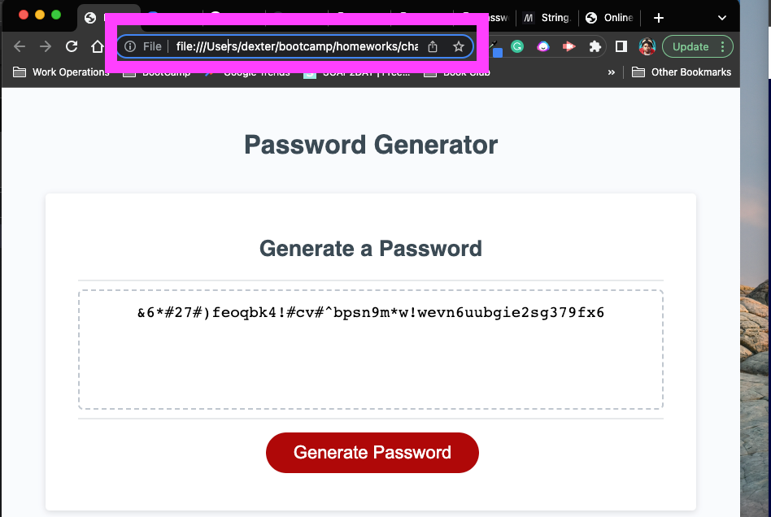
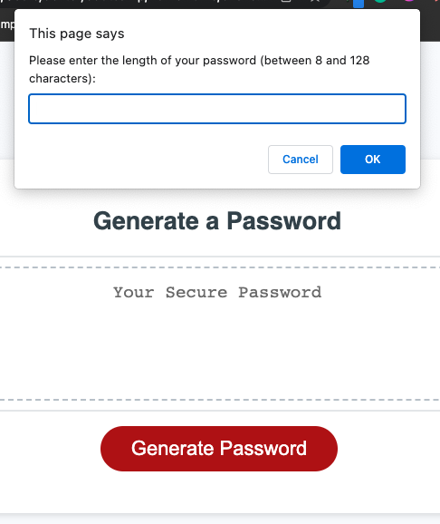
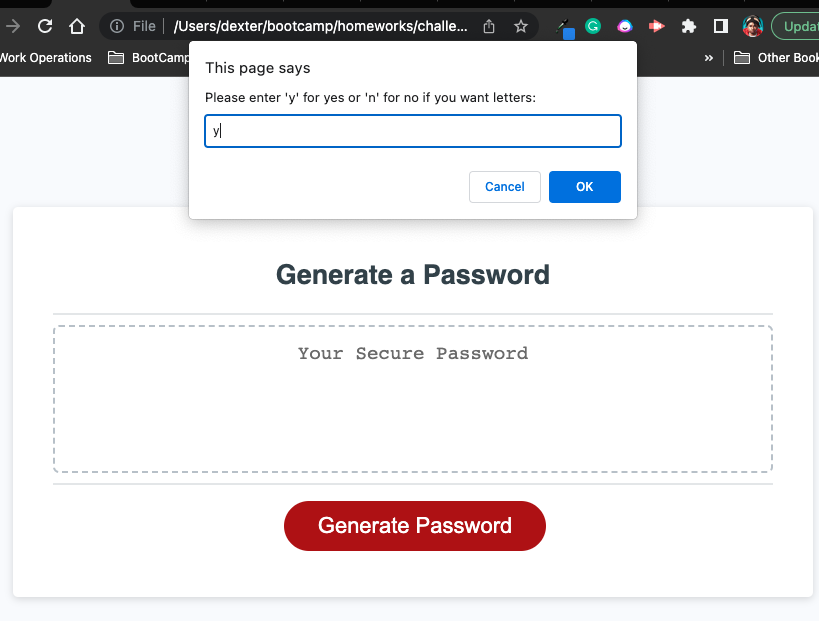
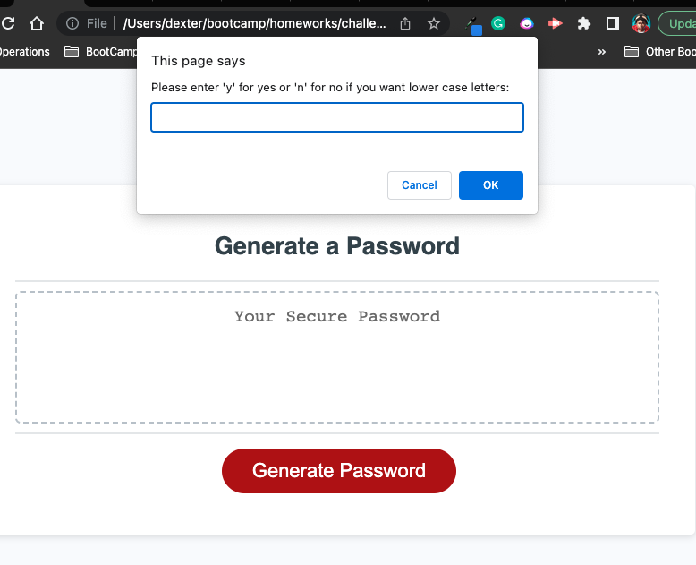
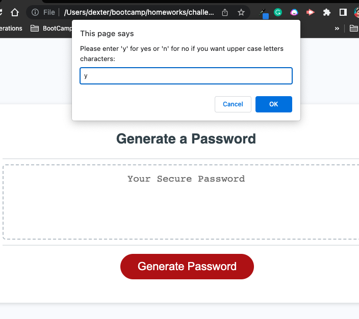

# challenge-three

## Description

The motivation for building this project was to learn and improve skills in web development, specifically in using JavaScript to create dynamic web applications with responsive user interfaces.

This challenge was for a practical purposes, such as providing employees with an easy and secure way to generate random passwords based on their preferences.

The problem that this project solves is the need for employees to create strong and unique passwords for their accounts or systems, which is crucial for maintaining data security and privacy.

The project fortified skills in web development, such as using JavaScript to manipulate the DOM, handling user input and preferences, generating random values, and creating responsive user interfaces.

## Table of Contents (Optional)

<<<<<<< HEAD
visit link:
=======
visit link: https://iam-dj.github.io/challenge-three/

```md

    ```
    ```md

    ```
    ```md

    ```
    ```md

    ```md

    ```

>>>>>>> 1957c8b (update readme and js)

## Installation

N/A

## Usage

Answer the questions when prompted and click gerenate to get your new password. 

## Credits

https://developer.mozilla.org/en-US/docs/Web/JavaScript/Reference/Global_Objects/String/charAt


## License

N/A
